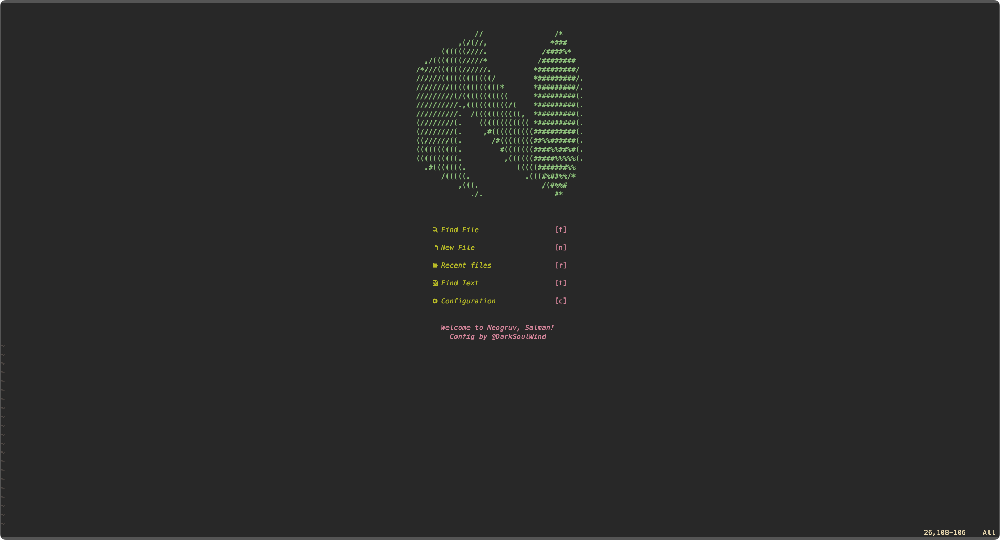
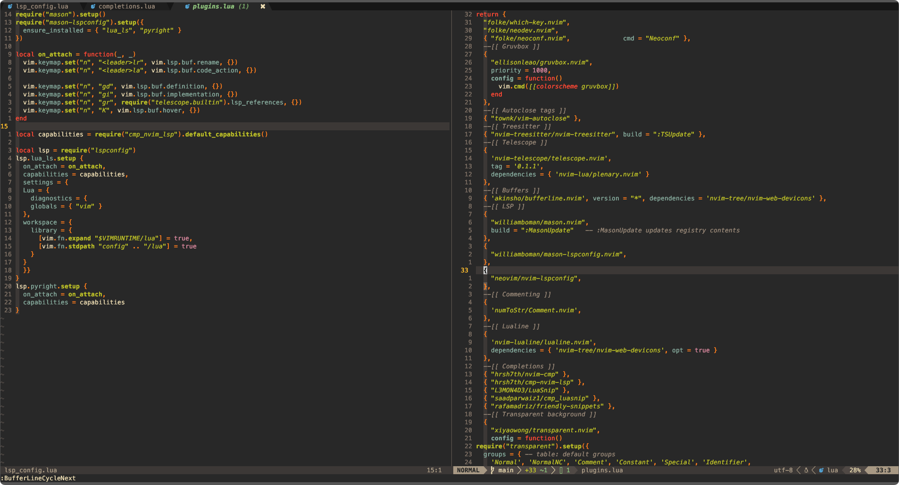

# Neogruv

My neovim config files, as stored in `$HOME/.config/nvim`. This is a work in progress.

Designed to be an IDE layer similar to LunarVim, Neogruv is the embodiment of a wannabe solo dev fixated on the beautiful aesthetics of his gruvbox ecosystem rather than focusing on being... well, a dev. Hope you enjoy :)

**Plugin manager:** Lazy.nvim

## Features

- [NvimTree](https://github.com/nvim-tree/nvim-tree.lua) - file exploration
- [Telescope](https://github.com/nvim-telescope/telescope.nvim) - fuzzy finder and live grep
- [Nvim-Treesitter](https://github.com/nvim-treesitter/nvim-treesitter) - syntax highlighter
- [Mason](https://github.com/williamboman/mason.nvim) - easy installation for new LSPs, formatters, linters and more
- [Null-ls](https://github.com/jose-elias-alvarez/null-ls.nvim) - formatting and linting
- [Cmp](https://github.com/hrsh7th/nvim-cmp) - code completion
- [Whichkey](https://github.com/folke/which-key.nvim) - keybind cheatsheet
- [Lualine](https://github.com/nvim-lualine/lualine.nvim) - statusline
- [Bufferline](https://github.com/akinsho/bufferline.nvim) - buffers and tabs
- [Gruvbox](https://github.com/ellisonleao/gruvbox.nvim) - sexy
- [Comment](https://github.com/numToStr/Comment.nvim) - comment toggling
- [Autoclose](https://github.com/m4xshen/autoclose.nvim) - autoclose brackets, parentheses, braces etc.
- [Dashboard](https://github.com/nvimdev/dashboard-nvim) - welcome to Neogruv

I love gruvbox
