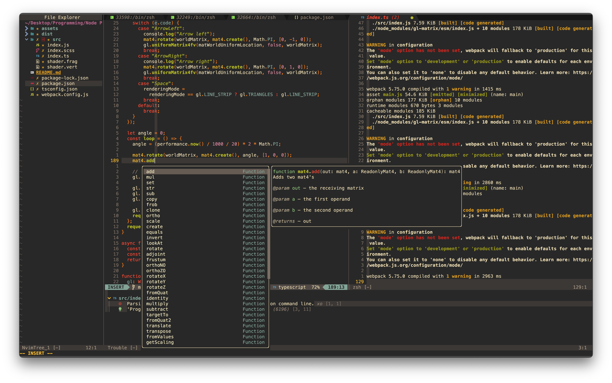

# Neogruv

My neovim config files, as stored in `$HOME/.config/nvim`. This is a work in progress.

**Plugin manager:** Lazy.nvim

- NvimTree
- Telescope
- TreeSitter
- Mason
- Null-ls
- Cmp
- Whichkey
- Lualine
- Bufferline
- Gruvbox
- Comment
- Autoclose
- Dashboard
